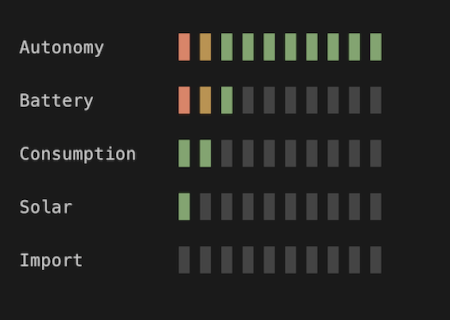

# Power Monitor

Terminal-based power monitor for Fronius solar inverters. Displays live bar charts for autonomy, battery charge, consumption, PV output, and grid import/export.

### Screenshot



### Build

```sh
mix deps.get
mix escript.build
```

This produces a standalone `./power_monitor` escript.

### Run

```sh
./power_monitor              # Connect to inverter at 192.168.178.53
./power_monitor --test       # Cycle through test data (no network needed)
./power_monitor --debug      # Show raw values next to each bar
```

The URL is hardcoded in `lib/power_monitor.ex` as `@url`. Change it there before building.

### TODO

- [ ] Make the inverter vendor configurable
- [ ] Setup for Nerves project
- [ ] Add unit tests


